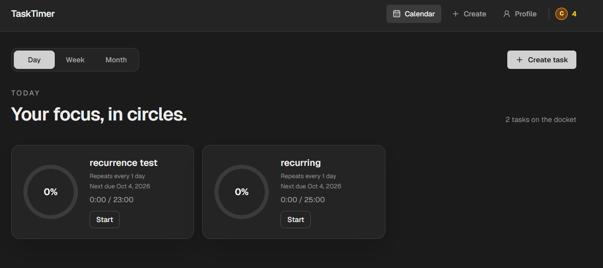
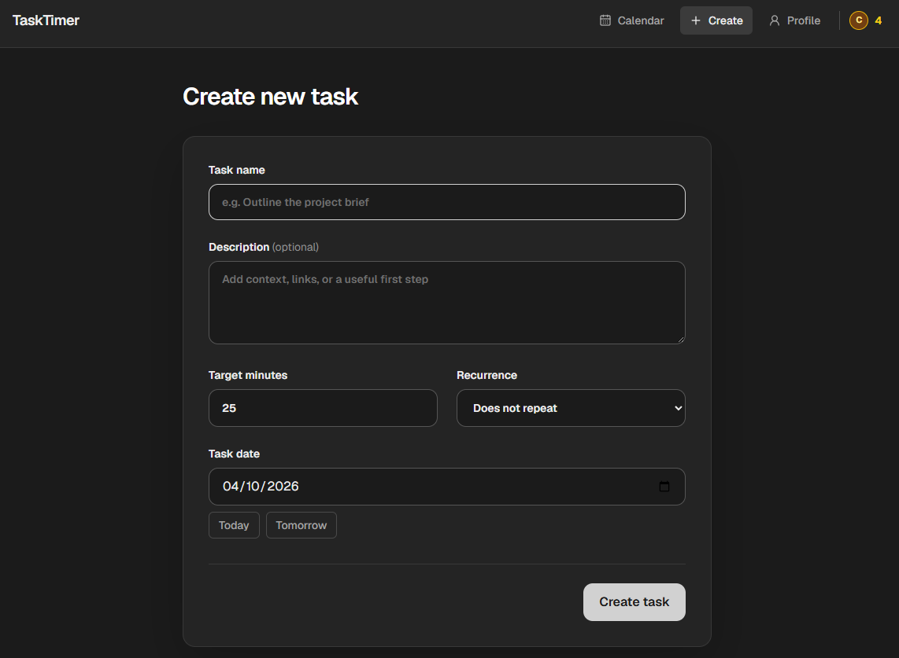

# TaskTimer

### A full stack web application built to help you keep track of your tasks and actually finish them.

## [Website Link](https://vercel.com/edvale73/task-timer)

## Overview

There are many todo apps (i.e., Google Tasks), and many focus apps (i.e., Forest). This aims to combine the two, allowing you to create specific tasks, choose how long you want to focus on that task, and then focus. 

## Images

### Home Page with Task Focus Rings

### Create Page

## Implemented Features

### Single or Recurring Tasks
- Users can set tasks for specific days, along with how long they want to focus on that task for
- Tasks can be made to repeat every set amount of days/weeks/months
- Tasks are deemed as completed if the sum of the task sessions associated with that task is greater than the target time

### Server Task Sync
- Task timers are synced with the server every 15 seconds, in order to keep continuity.
- Allows for consistency if opened in multiple browser tabs.

### Focus Rings
- Tasks for that day appear as rings, displaying the total focus time, the percentage focused, and the description
- Users can start/stop focusing for each task

### Task Calendar
- Users can view their upcoming tasks in a calendar format, either week or month view

### Coins
- Users earn coins for each minute of completed focus time
- Coins are only earnt from a completed task
- Transactions are stored in the database as an immutable record, and this transaction history is available to view

### Authentication
- BetterAuth used to login, sign up, logout
- Google login also available

## Stack

### Frontend
- Next.js
- React
- TypeScript
- TailwindCSS

### Database
- Neon Serverless Postgres

### Development
- Git
- GitHub
- GitHub Actions

### Hosting
- Vercel

## Database Schema

### Authentication
- BetterAuth uses `account`, `user`, `session` and `verification` tables for authentication process, which is handled automatically

### `task`
- This table stores each task
- Fields: 
- `id`
- `user_id` - the id of the user who created the task,
- `title`, 
- `description`, 
- `target_minutes` - how long the user wants to focus on that task for, 
- `recurrence_interval` - an integer dictating how long in days/weeks/months between scheduled tasks, NULL if not recurring,
- `recurrence_unit` - day/week/month, NULL if not recurring,
- `recurrence_start_date` - if recurring, when is the first instance. if not recurring, this is the only instance,
- `monthly_overflow_behaviour` - defaults to last day of month,
- `is_archived` - tasks can be archived,
- `created_at` - timestamp when created,
- `updated_at` - timestamp when updated,
- `recurrence_type` - dictates whether the task recurs or not (once/recurring)

### `task_session`
- This table stores each task session
- A task session is an instance where the user is focusing on a specific task
- Task sessions are summed up to calculate whether a task is complete
- Task session timers are synced to the server every 15 seconds to ensure consistency across browser tabs and to reduce timer drift.
- Fields:
- `id`,
- `user_id`, link to user,
- `task_id`, link to task,
- `started_at` - timestamp when task session was started,
- `ended_at` - timestamp when task session was ended,
- `duration_seconds` - the duration, in seconds, of the task session. this is used in the calculations of task completion,
- `created_at`, 
- `updated_at`

### `coin_transaction`
- This table stores coin transactions
- This allows for the history of each coin transaction to be verified and tracked, rather than just adding to a coin total
- Currently, this is used just to give the user coins when a task is completed.
- Fields:
- `id`, 
- `user_id`, 
- `task_id`, 
- `task_title` - the title of the transaction. currently just the task title, but may later be used for other things,
- `completed_on` - when was the transaction completed,
- `amount` - amount of coins awarded in the transaction,
- `created_at`, 
- `updated_at`

## Planned Features
- Mobile App
    - Using React Native?

- Add structured breaks
    - Pomodoro (5 min break for every 25 min of focus)
    - 50/10
    - Custom

- Collectables
    - Coins could be used to purchase collectables
    - Characters/cosmetics?

